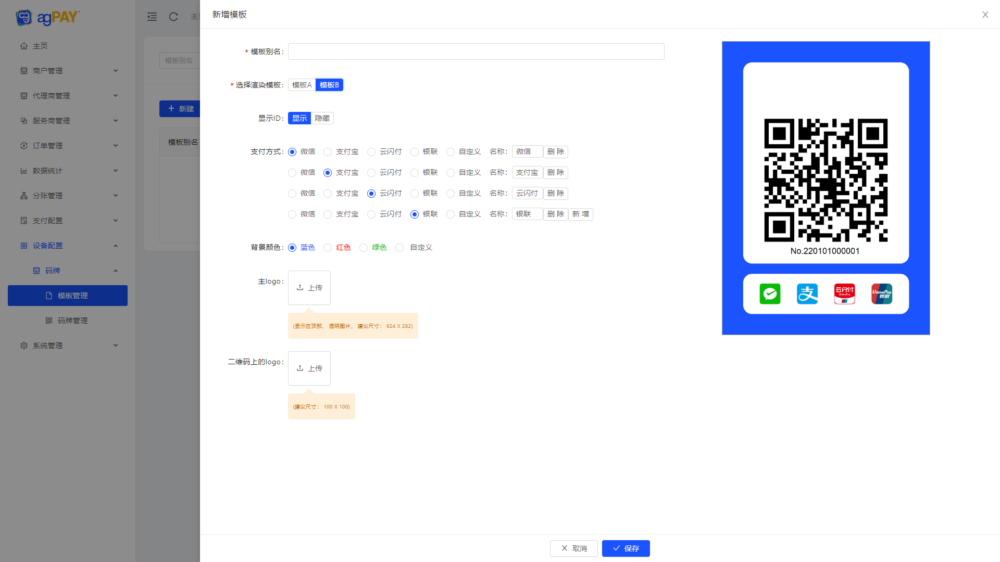

# 聚合支付平台

```
数据库脚本位置根目录 aspnet-core/docs/sql 文件夹 目前仅提供了 MySql 脚本。

后端技术：.Net8、EFCore8、AutoMapper、Swagger、FluentValidation、Log4Net、Redis、RabbitMQ、MediatR、Quartz.NET

前端技术：Vue2.x、Antd Of Vue 2.x

开发环境：Visual Studio 2022、.Net8.0、WebStorm
```

### 工程结构


### 功能列表


### ✨  部分截图


|  |  |
|-----------------------------------|---|

|  |  |
|-----------------------------------|---|

|  |   |
|-----------------------------------|---|

|  |   |
|-----------------------------------|---|

|  |   |
|-----------------------------------|---|

|  |    |
|-----------------------------------|---|

|  |   |
|-----------------------------------|---|

|  |   |
|-----------------------------------|---|

|  |   |
|-----------------------------------|---|
