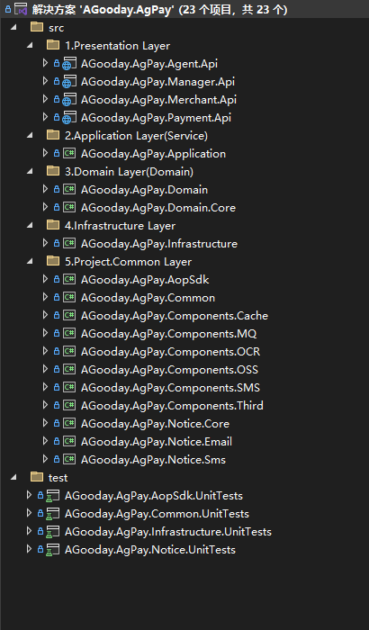

# 聚合支付平台
AgPay 是一套适合互联网企业使用的支付系统，支持多渠道服务商和普通商户模式。已对接微信支付官方、支付宝官方、云闪付、随行付、乐刷、嘉联、汇付斗拱、银盛等接口，支持聚合码支付。AgPay 基于.Net 9，使用 Web API 开发，实现权限管理功能，是一套非常实用的 Web 开发框架。AgPay 对应的前端项目，包括运营平台、代理商系统、商户系统、聚合码收银台。前端技术以 Vue 为主，框架使用 Ant Design Vue 开发。

数字化聚合支付平台，多渠道接口、交易、退款、分账、转账。支持 SAAS 模式，支持服务商模式，多个服务商独立运营，支持多级代理商，每级代理支持分润，为商户提供线上线下支付产品，支持 Docker 一键部署。

```
数据库脚本位置根目录 aspnet-core/docs/sql 文件夹 目前仅提供了 MySql 脚本。

后端技术：.Net9、EFCore9、Web API、Swagger、WebSocket、AutoMapper、FluentValidation、Log4Net、MediatR、Redis、RabbitMQ、Quartz.NET、SkiaSharp

前端技术：Vue2.x、Antd Of Vue 2.x

开发工具：Visual Studio 2022、SQLyog、WebStorm

接口文档：https://www.yuque.com/xiangyisheng/agooday/cweewhugp7h7hvml
```

### 工程结构




### 功能列表


### ✨  部分截图


|  |  |
|-----------------------------------|---|

|  |  |
|-----------------------------------|---|

|  |   |
|-----------------------------------|---|

|  |   |
|-----------------------------------|---|

|  |   |
|-----------------------------------|---|

|  |   |
|-----------------------------------|---|

|  |   |
|-----------------------------------|---|

|  |   |
|-----------------------------------|---|

|  |   |
|-----------------------------------|---|

|  |    |
|-----------------------------------|---|

|  |   |
|-----------------------------------|---|

|  |   |
|-----------------------------------|---|

|  |   |
|-----------------------------------|---|

|  |   |
|-----------------------------------|---|

|  |  |  |  |
| ------------ | ------------ | ------------ | ------------ |

### 项目结构
```
agpayplus/
├── aspnet-core/
│   ├── docs/
│   │   ├── sql/
│   │   │   └── agpayplusinit.sql
│   │   └── rabbitmq_plugin/
│   │       └── rabbitmq_delayed_message_exchange-3.13.0.ez
│   ├── src/
│   │   ├── AGooday.AgPay.Manager.Api/ (端口：9817)
│   │   │   ├── wwwroot/
│   │   │   ├── appsettings.json
│   │   │   ├── appsettings.Development.json
│   │   │   ├── AGooday.AgPay.Manager.Api.csproj
│   │   │   ├── log4net.config
│   │   │   ├── Program.cs
│   │   │   ├── Dockerfile
│   │   │   └── ...
│   │   ├── AGooday.AgPay.Agent.Api/ (端口：9816)
│   │   │   ├── wwwroot/
│   │   │   ├── appsettings.json
│   │   │   ├── appsettings.Development.json
│   │   │   ├── AGooday.AgPay.Agent.Api.csproj
│   │   │   ├── log4net.config
│   │   │   ├── Program.cs
│   │   │   ├── Dockerfile
│   │   │   └── ...
│   │   ├── AGooday.AgPay.Merchant.Api/ (端口：9818)
│   │   │   ├── wwwroot/
│   │   │   ├── appsettings.json
│   │   │   ├── appsettings.Development.json
│   │   │   ├── AGooday.AgPay.Merchant.Api.csproj
│   │   │   ├── log4net.config
│   │   │   ├── Program.cs
│   │   │   ├── Dockerfile
│   │   │   └── ...
│   │   └── AGooday.AgPay.Payment.Api/ (端口：9819)
│   │   │   ├── wwwroot/
│   │   │   │   └── cashier/
│   │   │   ├── appsettings.json
│   │   │   ├── appsettings.Development.json
│   │   │   ├── AGooday.AgPay.Payment.Api.csproj
│   │   │   ├── log4net.config
│   │   │   ├── Program.cs
│   │   │   ├── Dockerfile
│   │   │   └── ...
│   │   └── ...
│   ├── test/
│   ├── README.md
│   └── AGooday.AgPay.sln
├── ant-design-vue/
│   ├── agpay-ui-manager/ (vue-app 端口：8817)
│   │   ├── node_modules/
│   │   ├── public/
│   │   ├── src/
│   │   ├── .env
│   │   ├── .env.development
│   │   ├── package.json
│   │   ├── vue.config.js
│   │   ├── nginx.conf
│   │   └── Dockerfile
│   ├── agpay-ui-agent/ (vue-app 端口：8816)
│   │   ├── node_modules/
│   │   ├── public/
│   │   ├── src/
│   │   ├── .env
│   │   ├── .env.development
│   │   ├── package.json
│   │   ├── vue.config.js
│   │   ├── nginx.conf
│   │   └── Dockerfile
│   ├── agpay-ui-merchant/ (vue-app 端口：8818)
│   │   ├── node_modules/
│   │   ├── public/
│   │   ├── src/
│   │   ├── .env
│   │   ├── .env.development
│   │   ├── package.json
│   │   ├── vue.config.js
│   │   ├── nginx.conf
│   │   └── Dockerfile
│   ├── agpay-ui-cashier/ (vue-app 端口：8819)
│   │   ├── node_modules/
│   │   ├── public/
│   │   ├── src/
│   │   ├── .env
│   │   ├── .env.development
│   │   ├── package.json
│   │   └── vue.config.js
│   └── README.md
├── docs/
├── .gitignore
├── README.md
├── LICENSE
├── .env
├── .env.app
├── docker-compose-app.yml
└── docker-compose.yml
```

### Docker
```
# 创建网络
docker network create agpay-plus-network

# Docker安装Redis
# Docker搜索redis镜像 命令：docker search <镜像名称>
docker search redis

# Docker拉取镜像 命令：：docker pull <镜像名称>:<版本号>
docker pull redis

# 运行 redis 容器
docker run -d --name agpay-plus-redis -p 6389:6379 --network agpay-plus-network redis

# Docker安装RabbitMQ
# 拉去镜像
docker pull rabbitmq:management

# 运行 rabbitmq 容器
docker run -d --hostname agpay-plus-rabbitmq --name agpay-plus-rabbitmq --network agpay-plus-network -p 15682:15672 -p 5682:5672 rabbitmq:3-management

# 根据 RabbitMQ 版本下载「rabbitmq_delayed_message_exchange」插件 https://www.rabbitmq.com/community-plugins.html
# 将刚下载的插件拷贝到容器内的 plugins 目录下
# Window
docker cp E:\agoodays\agpayplus\aspnet-core\docs\rabbitmq_plugin\rabbitmq_delayed_message_exchange-3.13.0.ez agpay-plus-rabbitmq:/plugins
# Linux
docker cp /root/agpayplus/aspnet-core/docs/rabbitmq_plugin/rabbitmq_delayed_message_exchange-3.13.0.ez agpay-plus-rabbitmq:/plugins/

# 进入rabbitmq命令
docker exec -it agpay-plus-rabbitmq /bin/bash

# 查看插件列表
root@agpay-plus-rabbitmq:/# rabbitmq-plugins list

# 查看插件是否存在
root@agpay-plus-rabbitmq:/# cd plugins
root@agpay-plus-rabbitmq:/plugins# ls |grep delay
root@agpay-plus-rabbitmq:/plugins# cd ../
# Enable 插件
root@agpay-plus-rabbitmq:/# rabbitmq-plugins enable rabbitmq_delayed_message_exchange

# 退出容器
root@agpay-plus-rabbitmq:/# exit

# 重启 RabbitMQ
docker restart agpay-plus-rabbitmq

# 构建并运行后端容器
# 构建 Docker 镜像
cd agpayplus/aspnet-core/src
agpayplus\aspnet-core\src> docker build --no-cache -t agpay-plus-manager-api -f ./AGooday.AgPay.Manager.Api/Dockerfile .
agpayplus\aspnet-core\src> docker build --no-cache -t agpay-plus-agent-api -f ./AGooday.AgPay.Agent.Api/Dockerfile .
agpayplus\aspnet-core\src> docker build --no-cache -t agpay-plus-merchant-api -f ./AGooday.AgPay.Merchant.Api/Dockerfile .
agpayplus\aspnet-core\src> docker build --no-cache -t agpay-plus-payment-api -f ./AGooday.AgPay.Payment.Api/Dockerfile .

# 将运行的容器连接到指定的网络，运行 docker network inspect agpay-plus-network 命令查看容器是否连接到了该网络
docker network connect agpay-plus-network agpay-plus-manager-api

# 生成证书并配置本地计算机
# https://learn.microsoft.com/zh-cn/aspnet/core/security/docker-https?view=aspnetcore-9.0
# https://www.linkedin.com/pulse/run-aspnet-core-api-docker-https-senthil-kumaran
# 创建目标目录
mkdir $env:USERPROFILE\.aspnet\https
# 生成并导出证书
# dotnet dev-certs https -ep %USERPROFILE%\.aspnet\https\agpayplusapi.pfx -p 123456
dotnet dev-certs https -ep $env:USERPROFILE\.aspnet\https\agpayplusapi.pfx -p 123456
# 验证证书是否已正确导出
ls $env:USERPROFILE\.aspnet\https
# 在 Linux 或 macOS 上，替换 $env:USERPROFILE（%USERPROFILE%） 为 ~ 并确保你有适当的权限：
dotnet dev-certs https -ep ~/.aspnet/https/agpayplusapi.pfx -p 123456
# 信任生成的证书
dotnet dev-certs https --trust

# 运行容器
# docker run -d --name agpay-plus-manager-api -p 9817:9817 --network agpay-plus-network agpay-plus-manager-api
# 使用为 HTTPS 配置的 ASP.NET Core 运行容器镜像
# docker run --rm -it -d --name agpay-plus-manager-api --network agpay-plus-network -p 5817:5817 -p 9817:9817 -e ASPNETCORE_URLS="https://+;http://+" -e ASPNETCORE_HTTPS_PORTS=9817 -e ASPNETCORE_Kestrel__Certificates__Default__Password="123456" -e ASPNETCORE_Kestrel__Certificates__Default__Path=/https/agpayplusapi.pfx -v $env:USERPROFILE\.aspnet\https:/https/ agpay-plus-manager-api
# docker run --rm -it -d --name agpay-plus-agent-api --network agpay-plus-network -p 5816:5816 -p 9816:9816 -e ASPNETCORE_URLS="https://+;http://+" -e ASPNETCORE_HTTPS_PORTS=9816 -e ASPNETCORE_Kestrel__Certificates__Default__Password="123456" -e ASPNETCORE_Kestrel__Certificates__Default__Path=/https/agpayplusapi.pfx -v $env:USERPROFILE\.aspnet\https:/https/ agpay-plus-agent-api
# docker run --rm -it -d --name agpay-plus-merchant-api --network agpay-plus-network -p 5818:5818 -p 9818:9818 -e ASPNETCORE_URLS="https://+;http://+" -e ASPNETCORE_HTTPS_PORTS=9818 -e ASPNETCORE_Kestrel__Certificates__Default__Password="123456" -e ASPNETCORE_Kestrel__Certificates__Default__Path=/https/agpayplusapi.pfx -v $env:USERPROFILE\.aspnet\https:/https/ agpay-plus-merchant-api
# docker run --rm -it -d --name agpay-plus-payment-api --network agpay-plus-network -p 5819:5819 -p 9819:9819 -e ASPNETCORE_URLS="https://+;http://+" -e ASPNETCORE_HTTPS_PORTS=9819 -e ASPNETCORE_Kestrel__Certificates__Default__Password="123456" -e ASPNETCORE_Kestrel__Certificates__Default__Path=/https/agpayplusapi.pfx -v $env:USERPROFILE\.aspnet\https:/https/ agpay-plus-payment-api
# Window
docker run -d --name agpay-plus-manager-api --network agpay-plus-network -p 5817:5817 -p 9817:9817 -v $env:USERPROFILE\.aspnet\https:/https/ agpay-plus-manager-api
docker run -d --name agpay-plus-agent-api --network agpay-plus-network -p 5816:5816 -p 9816:9816 -v $env:USERPROFILE\.aspnet\https:/https/ agpay-plus-agent-api
docker run -d --name agpay-plus-merchant-api --network agpay-plus-network -p 5818:5818 -p 9818:9818 -v $env:USERPROFILE\.aspnet\https:/https/ agpay-plus-merchant-api
docker run -d --name agpay-plus-payment-api --network agpay-plus-network -p 5819:5819 -p 9819:9819 -v $env:USERPROFILE\.aspnet\https:/https/ agpay-plus-payment-api
# Linux
docker run -d --name agpay-plus-manager-api --network agpay-plus-network -p 5817:5817 -p 9817:9817 -v ${HOME}/.aspnet/https:/https/ agpay-plus-manager-api
docker run -d --name agpay-plus-agent-api --network agpay-plus-network -p 5816:5816 -p 9816:9816 -v ${HOME}/.aspnet/https:/https/ agpay-plus-agent-api
docker run -d --name agpay-plus-merchant-api --network agpay-plus-network -p 5818:5818 -p 9818:9818 -v ${HOME}/.aspnet/https:/https/ agpay-plus-merchant-api
docker run -d --name agpay-plus-payment-api --network agpay-plus-network -p 5819:5819 -p 9819:9819 -v ${HOME}/.aspnet/https:/https/ agpay-plus-payment-api

# 停止并删除当前正在运行的 agpay-plus-manager-api 容器：
docker stop agpay-plus-manager-api
docker rm agpay-plus-manager-api

# 构建并运行前端容器
# 直接拉取所需的基础镜像
docker pull node:16-alpine
docker pull nginx:stable-alpine

# 构建 Docker 镜像
cd agpayplus/ant-design-vue
agpayplus\ant-design-vue> docker build --no-cache -t agpay-ui-manager -f ./agpay-ui-manager/Dockerfile .
agpayplus\ant-design-vue> docker build --no-cache -t agpay-ui-agent -f ./agpay-ui-agent/Dockerfile .
agpayplus\ant-design-vue> docker build --no-cache -t agpay-ui-merchant -f ./agpay-ui-merchant/Dockerfile .

# 运行容器
docker run -d --name agpay-ui-manager -p 8817:80 --network agpay-plus-network agpay-ui-manager
docker run -d --name agpay-ui-agent -p 8816:80 --network agpay-plus-network agpay-ui-agent
docker run -d --name agpay-ui-merchant -p 8818:80 --network agpay-plus-network agpay-ui-merchant

```

### Docker Compose
```
# 构建并启动服务
agpayplus> docker-compose -f docker-compose-app.yml --env-file .env.app up
# 使用 -d 参数可以在后台运行服务
agpayplus> docker-compose -f docker-compose-app.yml --env-file .env.app up -d

# 检查容器状态
agpayplus> docker-compose -f docker-compose-app.yml --env-file .env.app ps

# 重新构建并启动服务
agpayplus> docker-compose -f docker-compose-app.yml --env-file .env.app build
agpayplus> docker-compose -f docker-compose-app.yml --env-file .env.app up -d
```