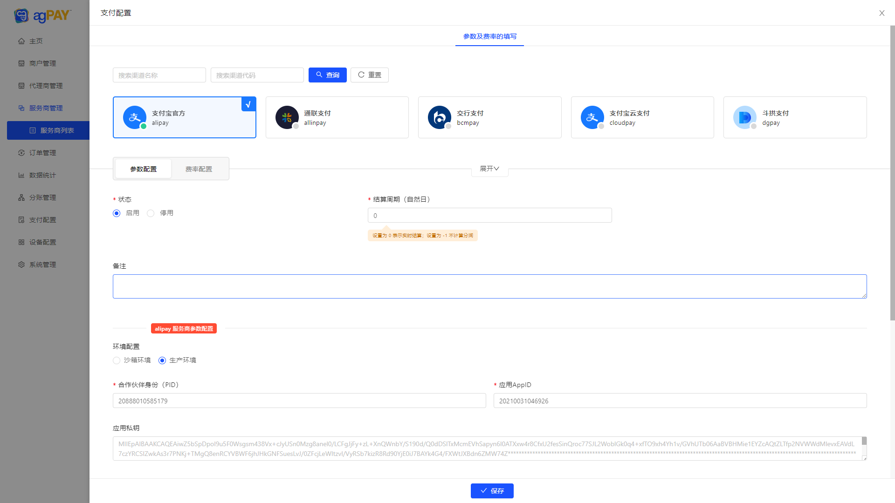

# 聚合支付平台

```
数据库脚本位置根目录 aspnet-core/docs/sql 文件夹 目前仅提供了 MySql 脚本。

后端技术：.Net8、EFCore8、Web API、Swagger、WebSocket、AutoMapper、FluentValidation、Log4Net、MediatR、Redis、RabbitMQ、Quartz.NET、SkiaSharp

前端技术：Vue2.x、Antd Of Vue 2.x

开发工具：Visual Studio 2022、SQLyog、WebStorm

接口文档：https://www.yuque.com/xiangyisheng/bhkges/cweewhugp7h7hvml?singleDoc# 《接口文档》
```

### 工程结构


### 功能列表


### ✨  部分截图


|  |  |
|-----------------------------------|---|

|  |  |
|-----------------------------------|---|

|  |   |
|-----------------------------------|---|

|  |   |
|-----------------------------------|---|

|  |   |
|-----------------------------------|---|

|  |    |
|-----------------------------------|---|

|  |   |
|-----------------------------------|---|

|  |   |
|-----------------------------------|---|

|  |   |
|-----------------------------------|---|

|  |   |
|-----------------------------------|---|

### Docker安装Redis和RabbitMQ
```
# Docker中安装Redis

# 创建网络
docker network create agpay-plus-network

# Docker搜索redis镜像 命令：docker search <镜像名称>
docker search redis

# Docker拉取镜像 命令：：docker pull <镜像名称>:<版本号>
docker pull redis

# 运行 redis 容器
docker run -d --name agpay-plus-redis -p 6389:6379 --network agpay-plus-network redis

# 拉去镜像
docker pull rabbitmq:management

# 运行 rabbitmq 容器
docker run -d --hostname agpay-plus-rabbitmq --name agpay-plus-rabbitmq --network agpay-plus-network -p 15682:15672 -p 5682:5672 rabbitmq:3-management

# 根据 RabbitMQ 版本下载「rabbitmq_delayed_message_exchange」插件 https://www.rabbitmq.com/community-plugins.html
# 将刚下载的插件拷贝到容器内的 plugins 目录下
docker cp F:\rabbitmq_plugin\rabbitmq_delayed_message_exchange-3.12.0.ez agpay-plus-rabbitmq:/plugins

# 进入rabbitmq命令
docker exec -it agpay-plus-rabbitmq /bin/bash

# 查看插件列表
root@agpay-plus-rabbitmq:/# rabbitmq-plugins list

# 查看插件是否存在
root@agpay-plus-rabbitmq:/# cd plugins
root@agpay-plus-rabbitmq:/plugins# ls |grep delay
root@agpay-plus-rabbitmq:/plugins# cd ../
# Enable 插件
root@agpay-plus-rabbitmq:/# rabbitmq-plugins enable rabbitmq_delayed_message_exchange

# 退出容器
root@agpay-plus-rabbitmq:/# exit

# 重启 RabbitMQ
docker restart agpay-plus-rabbitmq
```